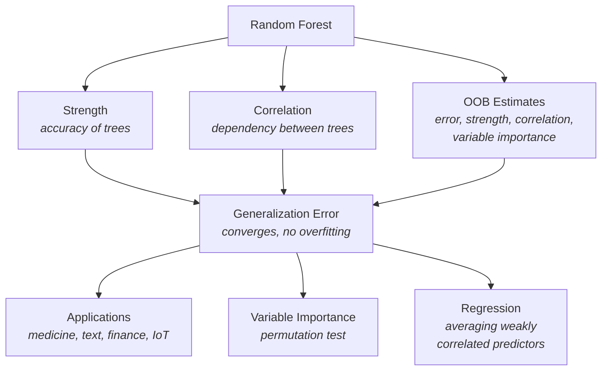

# 📌 Full Summary
- **Core Idea**: Random Forests are ensembles of decision trees built using randomness (bagging + random feature selection). Each tree votes, and the majority class is chosen.
- **Convergence**: As the number of trees grows, generalization error converges to a limit (no overfitting).
- **Key Drivers of Accuracy**:
  - **Strength** of individual trees (how accurate they are).
  - **Correlation** between trees (lower correlation improves ensemble accuracy).
- **Random Feature Selection**: Selecting a random subset of features at each split reduces correlation while maintaining strength.
- **Out-of-Bag (OOB) Estimates**: Provide unbiased estimates of error, strength, correlation, and variable importance without needing a separate test set.
- **Performance**: Comparable or better than AdaBoost, but more robust to noise and faster to train.
- **Regression Extension**: Random Forests also apply to regression, reducing mean squared error by averaging weakly correlated predictors.
- **Variable Importance**: Measured by permuting feature values and observing the increase in error.
- **Applications**: Effective in high-dimensional problems (medical diagnosis, text retrieval) with many weak predictors.

# 🔑 Key Learnings
1. **Randomness is beneficial**: Injecting randomness (bagging, random features) reduces correlation and improves ensemble performance.
2. **No overfitting with more trees**: Unlike many models, adding trees doesn’t cause overfitting.
3. **Strength vs. Correlation trade-off**: Accuracy depends on balancing strong individual classifiers with low correlation.
4. **OOB estimates are powerful**: They eliminate the need for cross-validation or separate test sets.
5. **Robustness to noise**: Random Forests outperform AdaBoost when labels are noisy.
6. **Interpretability via variable importance**: Despite being a “black box,” RF provides insights into feature relevance.

# ⚠️ Limitations
1. **Interpretability**: While variable importance helps, the overall mechanism remains complex compared to single trees.
2. **Regression performance**: Gains are less pronounced than in classification.
3. **Bias reduction mechanism unclear**: RF reduces bias, but the exact theoretical explanation is not fully established.
4. **Large datasets**: Computational cost can be high, though parallelization helps.

# 🎯 Applications
1. **Medical diagnosis**: Handling many weak predictors (e.g., biomarkers).
2. **Document retrieval & text classification**: High-dimensional sparse inputs.
3. **Image recognition**: Random feature subsets improve accuracy.
4. **Finance & credit scoring**: Robustness to noise and interpretability of variable importance.
5. **IoT & sensor networks**: Handling heterogeneous, noisy data streams.

# 📝 Revision Notes
- **Definition**: Random Forest = ensemble of decision trees with randomness in training and feature selection.
- **Generalization error**: Converges, no overfitting.
- **Strength**: Accuracy of individual trees.
- **Correlation**: Dependency between trees; lower is better.
- **OOB estimates**: Internal validation for error, strength, correlation, and variable importance.
- **Comparison to AdaBoost**: Similar accuracy, more robust to noise, faster.
- **Regression**: Works by averaging predictions; accuracy depends on low correlation of residuals.
- **Variable importance**: Measured by permuting features and observing error increase.

# 📚 Flashcards
**Q**: What is a Random Forest?  
**A**: An ensemble of decision trees built with randomness in training and feature selection, voting for the majority class.

**Q**: Why don’t Random Forests overfit as more trees are added?  
**A**: Because generalization error converges to a limit by the Law of Large Numbers.

**Q**: What two factors determine Random Forest accuracy?   
**A**: Strength of individual trees and correlation between them.

**Q**: What are Out-of-Bag (OOB) estimates?  
**A**: Internal estimates of error, strength, correlation, and variable importance using left-out samples from bagging.

**Q**: How do Random Forests compare to AdaBoost?  
**A**: Similar or better accuracy, more robust to noise, faster to train.

**Q**: How is variable importance measured in Random Forests?  
**A**: By permuting feature values and measuring the increase in misclassification error.

**Q**: What is the role of randomness in Random Forests?  
**A**: It reduces correlation between trees while maintaining strength, improving ensemble accuracy.

**Q**: What makes Random Forests unique compared to single decision trees?  
**A**: Randomness in training and feature selection reduces correlation and improves ensemble accuracy.

**Q**: Why don’t Random Forests overfit with more trees?  
**A**: Generalization error converges to a limit.

**Q**: What are Out-of-Bag (OOB) estimates?  
**A**: Internal validation for error, strength, correlation, and variable importance.

**Q**: How is variable importance measured?  
**A**: By permuting feature values and measuring the increase in error.

**Q**: How do Random Forests compare to AdaBoost?  
**A**: Similar accuracy, more robust to noise, faster to train.

